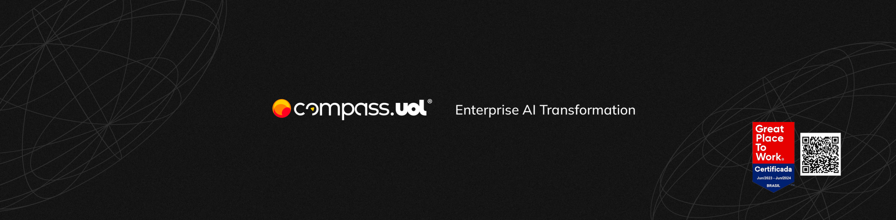

<a href="https://compass.uol/pt/home/"></a> <a href="https://compass.uol/pt/home/"></a>


# Sprint 8: Qualidade, AI e Challenge Final

## 🔎 Visão Geral 🔍
Este projeto final representa a aplicação prática de todos os conhecimentos adquiridos ao longo das sprints do programa. O desafio consistiu em testar e documentar a API Cinema, utilizando métodos e ferramentas de automação de testes para simular cenários reais de desenvolvimento e QA (Quality Assurance). Durante este trabalho, realizamos desde a criação de casos de teste e relatórios de bugs até a documentação e validação de funcionalidades.

## 🔒 Objetivo do Challenge Final 🔒
Neste desafio, nosso foco foi colocar em prática todas as habilidades aprendidas ao longo do programa, especificamente:
- **Relatar e Documentar Bugs:** Identificar e documentar bugs encontrados na API, criando relatórios detalhados que descrevem os problemas, resultados esperados e observados.
- **Criar Casos de Teste e Automatizar Testes:** Implementar casos de teste para as rotas da API **Cinema** (GET, POST, PUT, DELETE) e realizar automação de testes utilizando **Playwright**.
- **Documentação Completa do Projeto:** Elaborar uma documentação clara, contendo todas as etapas e observações sobre os testes realizados, com destaque para os erros e as soluções propostas.

## 🛠 Ferramentas Utilizadas 💻
-  **JavaScript**: Linguagem principal para desenvolvimento dos testes e automações.
-  **Visual Studio Code**: Editor de código para desenvolvimento e organização do projeto.
-  **Playwright**: Ferramenta de automação utilizada para criação e execução de testes end-to-end.
-  **Postman**: Utilizado para testes manuais da rota **PUT** devido a dificuldades encontradas ao executar esses testes no **Playwright**.



## ❗️ Desafios e Observações 🔎
Durante a realização do projeto, enfrentamos alguns desafios, principalmente relacionados à automação de testes na rota **PUT** da API Cinema. Devido a erros recorrentes ao tentar automatizar essa rota no **Playwright**, optamos por utilizar o **Postman** para a realização de testes manuais e verificação das funcionalidades. Este cenário refletiu a importância de saber adaptar ferramentas e soluções conforme as limitações encontradas.

## ♻️ Reutilização de Código 🔄
Durante o desenvolvimento dos testes para a API **Cinema**, a reutilização de código foi essencial para garantir a consistência e a eficiência no processo. Para as rotas **DELETE** e **GET**, implementamos funções auxiliares que possibilitaram uma abordagem mais modular e organizada. 

- **Funções Auxiliares:** Criamos funções auxiliares para operações comuns, como a **criação de filmes temporários**. Essas funções foram utilizadas em testes que exigem um ID de filme válido, como nas rotas de **DELETE** e **GET{id}**. Ao reutilizar essas funções, conseguimos evitar duplicação de código, tornando o processo mais eficiente e fácil de manter.
  
- **Modularidade e Flexibilidade nos Testes:** Nos testes de **DELETE** e **GET{id}**, utilizamos a mesma função de criação de filmes, mas adaptamos o uso de acordo com a necessidade de cada verbo HTTP. Dessa forma, ao alterar um detalhe na função auxiliar, conseguimos automaticamente aplicar essa mudança em todos os testes que a utilizam, facilitando a manutenção.

Essa estratégia de reutilização e modularidade não apenas acelerou o desenvolvimento dos testes, como também assegurou que os cenários fossem executados de forma padronizada e consistente. Além disso, ao lidar com cenários complexos ou testes de integração, essa abordagem permitiu uma melhor adaptação das funções para casos específicos, garantindo a flexibilidade necessária.


## ⛓ Estrutura do Projeto ⛓
O projeto está organizado nas seguintes seções:
- **Casos de Teste e Automação:** Implementação dos casos de teste para as rotas da API **Cinema**, abordando cenários de criação, consulta, atualização e exclusão de filmes.
- **Relatório de Bugs:** Documento que descreve os bugs encontrados na API, incluindo os requisitos de cada rota, os resultados esperados e os observados.
- **Documentação Completa:** Estrutura de documentação do projeto que inclui as instruções para execução dos testes, as ferramentas utilizadas e as observações gerais.

## 🗂 Documentação do Projeto 📚

Durante o desenvolvimento deste projeto, foram geradas diversas documentações essenciais para assegurar a qualidade e o controle das atividades de teste. Abaixo estão os links para cada um dos documentos relevantes:

- [DoR e DoD | Usuários & Login](https://gitlab.com/challengers9091030/challenge-final/-/wikis/DoR-e-DoD-%7C-usuarios-&-login-%7C)
- [Casos de Teste | Movies & Tickets](https://gitlab.com/challengers9091030/challenge-final/-/wikis/home)
- [Matriz de Rastreabilidade](https://gitlab.com/challengers9091030/challenge-final/-/wikis/Matriz-de-rastreabilidade)
- [Plano de Teste | Movies & Tickets](https://gitlab.com/challengers9091030/challenge-final/-/wikis/Plano-de-teste)
- [Relatório de Testes](https://gitlab.com/challengers9091030/challenge-final/-/wikis/Relatório-de-testes)
- [Métricas](https://gitlab.com/challengers9091030/challenge-final/-/wikis/Métricas)

## 📑 Instruções de Execução 📝
Aqui está um guia detalhado para instalar as ferramentas necessárias no **Windows** e utilizar o terminal para completar a instalação:

---

# Instruções de Instalação no Windows

### 1. Instalando o Node.js e NPM

O **Node.js** vem com o NPM (Node Package Manager), que é o gerenciador de pacotes que usaremos para instalar outras dependências.

#### Passo 1: Baixando o Instalador do Node.js

1. Acesse o site oficial do Node.js em [https://nodejs.org/](https://nodejs.org/).
2. Baixe a versão **LTS** (suporte a longo prazo) para Windows, pois é a mais estável e recomendada para desenvolvimento.

#### Passo 2: Instalando o Node.js

1. Após o download, localize o arquivo `.msi` (instalador do Node.js) em sua pasta de downloads e clique duas vezes para abrir.
2. No instalador do Node.js:
   - Clique em **Next** para avançar.
   - Aceite os termos de licença e clique em **Next**.
   - Mantenha o diretório de instalação padrão e clique em **Next**.
   - Na tela de seleção de componentes, deixe todas as opções selecionadas e clique em **Next**.
   - Clique em **Install** para iniciar a instalação.

3. Após a instalação, clique em **Finish** para completar o processo.

#### Passo 3: Verificando a Instalação do Node.js e NPM

Para confirmar que o Node.js e o NPM foram instalados corretamente:

1. Abra o **Prompt de Comando**:
   - Pressione `Win + R`, digite `cmd` e pressione **Enter** para abrir o Prompt de Comando.

2. No Prompt de Comando, verifique as versões do Node.js e NPM com os comandos:

   ```bash
   node -v
   npm -v
   ```

   Esses comandos devem retornar as versões instaladas, indicando que a instalação foi bem-sucedida. Algo como:

   ```
   v16.14.2
   8.5.0
   ```

---

### 2. Instalando o Playwright e Dependências do Projeto

Com o Node.js e o NPM instalados, você pode prosseguir com a instalação do **Playwright** e das outras dependências do projeto.

#### Passo 1: Clonando o Repositório do Projeto

1. Abra o **Prompt de Comando** e navegue até a pasta onde deseja salvar o projeto.
   - Por exemplo, para acessar a área de trabalho, digite:

     ```bash
     cd Desktop
     ```

2. Clone o repositório do projeto (substitua o link abaixo pelo link do repositório específico):

   ```bash
   git clone https://github.com/seu-usuario/seu-repositorio.git
   ```

3. Acesse a pasta do projeto:

   ```bash
   cd seu-repositorio
   ```

#### Passo 2: Instalando Dependências com NPM

Dentro da pasta do projeto, instale todas as dependências listadas no arquivo `package.json`. Isso inclui o Playwright e outras bibliotecas necessárias para rodar a API e os testes.

Execute o comando:

```bash
npm install
```

Esse comando baixa todas as dependências do projeto.

#### Passo 3: Instalando o Playwright e os Navegadores

O Playwright exige navegadores específicos para executar testes. Instale o Playwright junto com os navegadores usando o comando:

```bash
npx playwright install
```

Esse comando fará o download dos navegadores compatíveis, como Chrome, Firefox e WebKit, que são necessários para os testes.

---

### 3. Executando o Projeto Localmente

Com todas as dependências instaladas, você pode iniciar a API de Cinema localmente.

1. No Prompt de Comando, ainda dentro da pasta do projeto, execute o comando:

   ```bash
   npm run start
   ```

2. Após rodar o comando, a aplicação estará disponível localmente em [http://localhost:3000](http://localhost:3000).

---

### 4. Executando Testes Automatizados com Playwright

Para validar se a API está funcionando corretamente, execute os testes automatizados com o Playwright.

No Prompt de Comando, digite:

```bash
npx playwright test tests/movies
```
```bash
npx playwright test endToEnd/endToEnd.spec.js
```

O Playwright executará todos os testes configurados no projeto, e você verá o resultado diretamente no terminal.

---

Esses passos garantem que você tenha tudo configurado corretamente no **Windows**, com o Node.js, NPM, e Playwright instalados, permitindo que você execute a API localmente e realize testes automatizados.

## 📩 Intruções de Commits 💌

   - ADD: (Adicionando).
   - DELETE: (Delete).
   - AJUST: (Ajustando).

## 📞 Contato 📧
Caso tenha dúvidas ou deseje mais informações sobre o projeto, você pode entrar em contato comigo através dos canais abaixo:

- **E-mail:** [danilovargas@alunos.utfpr.edu.br](mailto:danilovargas@alunos.utfpr.edu.br)
- **LinkedIn:** [Danilo Silva Vargas](https://www.linkedin.com/in/danilo-silva-vargas-b407512aa/)

<a href="https://www.linkedin.com/in/danilo-silva-vargas-b407512aa/"></a>

## 🤝 Citação de colegas 🤝

   - Pedro Paulo Valente Bittencourt (Tipos de BUGS, Playwright x Postman).
   - Gabriela Wegrcyn Salmon (Treino para apresentação, cénarios).
   - Thales Heron de Assunção Granja (Mapa mental, Bug de documentação).


<a href="https://compass.uol/pt/home/"></a> <a href="https://compass.uol/pt/home/"></a>
